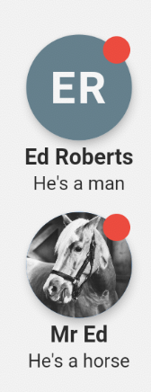

# ff_contact_avatar
A highly configurable Column widget for displaying a contact avatar with name and short message.


## Add dependency
```
dependencies:
  ff_contact_avatar: ^0.1.0
```

## Basic use
```
import 'package:flutter/material.dart';
import 'package:ff_contact_avatar/ff_contact_avatar.dart';
...
    return Scaffold(
      appBar: AppBar(
        title: Text(widget.title),
      ),
      body: Center(
        child: Column(
          mainAxisAlignment: MainAxisAlignment.center,
          children: <Widget>[
            FFContactAvatar(
              name: 'Ed Roberts',
              message: 'He\'s a man',
              showBadge: true,
            ),
            SizedBox(height: 10),
            FFContactAvatar(
              name: 'Mr Ed',
              message: 'He\'s a horse',
              image: Image.network(
                  'https://upload.wikimedia.org/wikipedia/commons/8/81/Mister_Ed.JPG'),
              showBadge: true,
            ),
          ],
        ),
      ),
    );
```

## Theme
The avatar has a Theme class which can be used to define the majority of appearance settings for the avatar.
* backgroundColor: The background color for the CircleAvatar when initials are being displayed (i.e. no image) (default = blueGrey)
* foregroundColor: The color to use for the text of initials (default = white)
* badgeColor: The color to use for the notification badge circle (default = red)
* avatarRadius: The radius of the CircleAvatar widget (default = 31)
* initialsTextStyle: The default text style for initials (default = bold, 26pt with 1.4 letter spacing)
* nameTextStyle: The default text style for the name (default = bold, 13pt)
* messageTextStyle: The default text style for the message (default = normal, 11pt)
* verticalPadding: The space to include between each vertical component (default = 2.0)
* avatarElevation: The elevation to be used for drop shadow effect (default = 4.0)

## FFContactAvatar Attributes
* theme: A FFContactAvatarTheme theme object
* image: An Image object for the image to display in the CircleAvatar
* name: A String of the contact name to display (will also be used to create the initials if no image is provided, with a maximum initials length of 2)
* message: A string of the message to display
* showBadge: A bool value indicating if the notification badge should be displayed (default = false)